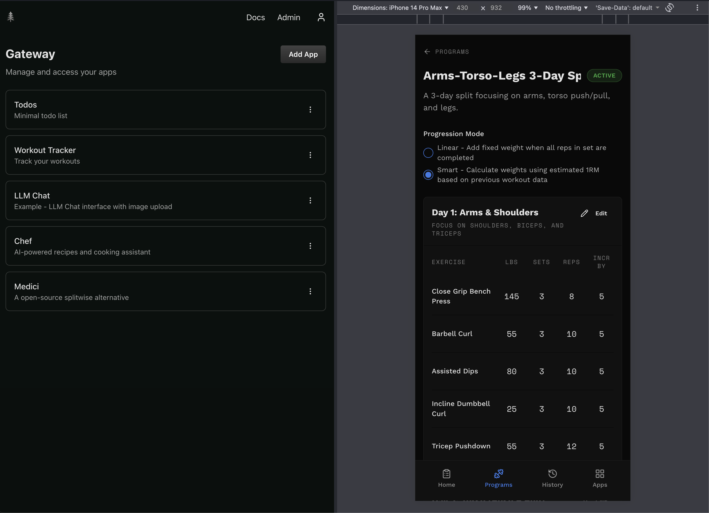

# Every App
The open source personal software platform.
- Build what you wish existed.
- Bring your own AI. No credits, no limits.
- Self-host on Cloudflare. Free to start, $5/month max.

## What is Every App?

Every App is a self-hosted platform for personal web apps. Use your favorite coding agent to build apps tailored to yourself, family, friends or your company.

Every App handles the boring parts like auth and hosting so that you can focus on building your idea.

Self host on Cloudflare with one simple CLI command which deploys your code and provisions any infrastructure like databases or queues. Since apps are built for Cloudflare's Serverless platform, hosting starts completely free. Even with dozens of apps, you're unlikely to exceed the $5/month paid plan.

Make your app open source, sharing it online for others to use.

## Coding Agents & Vibe Coding
Every App is for Engineers. It’s designed so that you can build awesome apps leveraging Coding Agents quickly, but with an unlimited ceiling of quality.

After you follow the instructions for setting up the Gateway, start with just vibe coding an idea you have, reimplement an old side project or test the example prompt in Build an App for building a kanban board. This will be a full stack app with a database and any other infra you need from Cloudflare, not a toy app that only works on localhost.

Once you’ve built something you love, you could stay in this Vibe Coding zone forever (please use the Security Review prompt), or you could dig deeper and build the best project of your life.

### Screenshots

This screenshot is of a split window.

- Left - Gateway showing the apps the user is self hosting
- Right - Workout App: Program editor page



## What is the Gateway?

The Gateway is the parent application where you manage and access your apps.

If you look at normal SaaS or Consumer apps, they each implement the same stuff over and over like authentication and user management.

We simplify building apps by standardizing as much as possible and hoisting what we can into the Gateway.

### Gateway Features:
- Single URL 
    - Go to your Gateway. Access all your apps.
- Authentication
    - Users log into the Gateway. Apps inherit auth from the Gateway. You don't need to worry about screwing up auth or building out frontend flows.
- User Management 
    - Add other users to the Gateway so that they can use the apps.
- Mobile Optimized 
    - User adds Gateway to their home screen once. All apps get the benefits of being rendered within the Gateway.
- LLM Gateway (Coming soon) 
    - Configure LLM provider once, instead of once per app. Define per-app budgets.
- App Management (Coming soon)
    - Deploy and update apps via the UI instead of by running CLI commands to deploy.

## Self Hosting

### Prerequisites

1. Make a Cloudflare Account (No credit card needed) - https://dash.cloudflare.com/sign-up
2. Authenticate with Cloudflare (choose one):
   - Login via the Cloudflare CLI (recommended):
     ```bash
     npx wrangler login
     ```
   - Or set the `CLOUDFLARE_API_TOKEN` environment variable

### Self Host Gateway

```bash
npx @every-app/cli gateway deploy
```

Follow the link this returns to create your account in the Gateway.

### Self Host Apps

#### Todo App

```bash
npx gitpick every-app/every-app/tree/main/apps/todo-app every-todo-app
cd every-todo-app
npx @every-app/cli app deploy
```

#### Workout Tracker

```bash
npx gitpick every-app/every-app/tree/main/apps/workout-tracker every-workout-tracker
cd every-workout-tracker
npx @every-app/cli app deploy
```

#### Cooking Assistant
Note: This only works on the Paid plan since the bundle is too big currently. 

```bash
npx gitpick every-app/every-app/tree/main/apps/chef every-app-chef
cd every-app-chef
npx @every-app/cli app deploy
npx wrangler secret put OPENAI_API_KEY
```

## Build Your Own App
The create command deploys your app to Cloudflare, registers it with your Gateway and sets up your local development environment.

```bash
npx @every-app/cli app create
cd your-project-name
pnpm run dev
```

Click the "Dev" button for the app in the Gateway to use your local dev server instead of the deployed version.

### Coding Agent Setup
#### Why are they good at building for Every App?
Coding Agents are realllllly good at building these apps.

Agents usually struggle on new projects because there aren't any patterns defined yet. They struggle in legacy codebases because they're very complex and have lots of bad code to reference as example.

We've been meticulous about the example applications having well-defined patterns that agents can follow. These patterns cover most of what every full stack app needs. It's your job to figure out the rest!

#### Setup
Add the Every App MCP server to your agent so that it can reference the example applications when building your app. Remember to remind it to use this tool if its not automatically.

Add to your `opencode.json`:

```jsonc
{
  "mcp": {
    "every-app": {
      "type": "local",
      "command": ["npx", "-y", "@every-app/mcp"]
    },
    // Tool for up to date documentation for libraries + Cloudflare
    "context7": {
      "type": "local",
      "command": [ "npx", "-y", "@upstash/context7-mcp"]
    }
}
```

For other AI tools (Claude Code, Cursor, etc.), see the [Coding Agent Setup docs](https://everyapp.dev/docs/coding-agent/setup/).

## Docs
Reference the full docs to learn more: 
- https://everyapp.dev/docs
