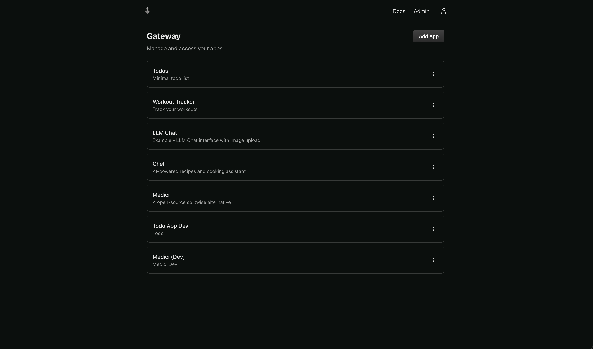
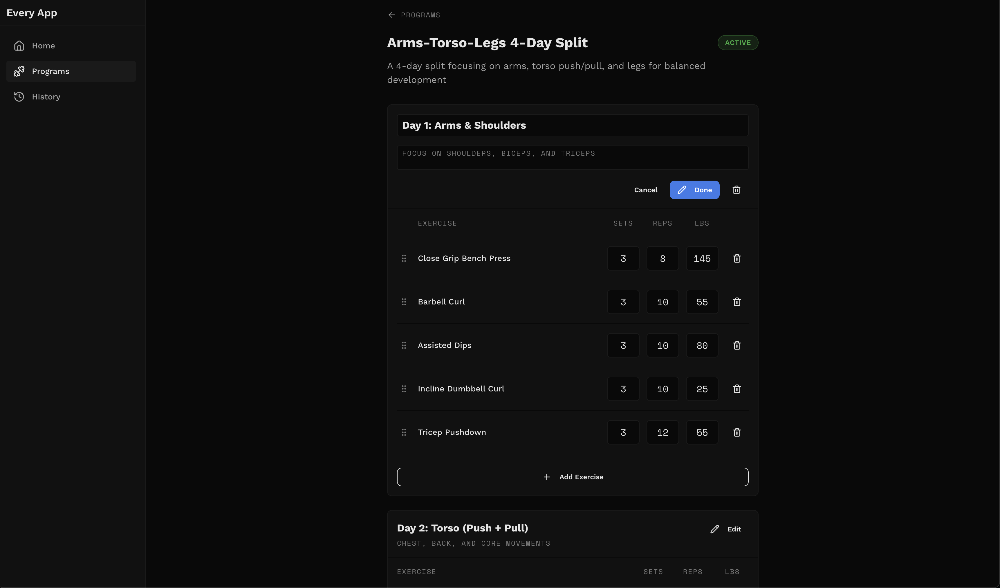

# What is Every App?

Every App is a self-hosted platform for running personal web applications. 

Deploy the Gateway to your Cloudflare account, and access all your apps through a single interface.

Build apps for yourself, share them with the community, or host apps others have built with one simple command.

## Every App Handles the Boring Parts
The goal is to handle the boring parts so you can focus on building your idea:
- **1 command self hosting**
- **Simplified auth** 
- **Real full stack examples from other open source apps** 
- **AI prompts for building features and maintaining your codebase**

### Gateway Home Page


### Example Page in Workout Tracker


## What is the Every App Gateway?
The Gateway is the parent application that hosts all your embedded apps. It provides:

- **Single URL** - Access all apps from one place
- **Shared Auth** - Log in once, access all apps
- **PWA Support** - Add to home screen, all apps inherit PWA benefits
- **LLM Gateway (Coming soon)** - Configure LLM provider once, instead of once per app. Define per-app budgets.

Apps run inside the Gateway's iframe and receive scoped session tokens for authentication, so you don't need to implement auth in your apps.

## Self Host
### Prerequisites
1. Make a Cloudflare Account (No credit card needed)
- https://dash.cloudflare.com/sign-up
2. Login via the Cloudflare CLI
```bash
npx wrangler login
```
3. Install the Every App CLI
```bash
npm i -g @every-app/cli
```

### Self Host Gateway
```bash
every gateway deploy
```

Follow the link to create your account.


### Self Host Apps


#### Todo App


```bash
npx gitpick every-app/every-app/tree/main/apps/todo-app every-todo-app
cd every-todo-app
every app deploy
```


#### Workout Tracker


```bash
npx gitpick every-app/every-app/tree/main/apps/workout-tracker every-workout-tracker
cd every-workout-tracker
every app deploy
```


#### Cooking Assistant


```bash
npx gitpick every-app/every-app/tree/main/apps/every-chef every-chef
cd every-chef
every app deploy
```


## Build Your Own App


```bash
every app create
cd your-project-name
pnpm install
pnpm run dev
```


Then add your app in the Gateway UI. The App ID must match your project name.


Reference the full docs to learn more. Here are key docs:
- Walkthrough of the AI Cooking Assistant: https://everyapp.dev/docs/walkthrough/overview/
- Coding Agent Setup: https://everyapp.dev/docs/coding-agent/setup/
- Helpful Prompts: https://everyapp.dev/docs/coding-agent/prompts/review-code/


